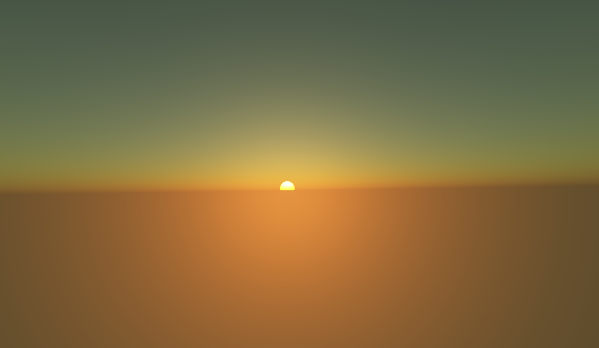
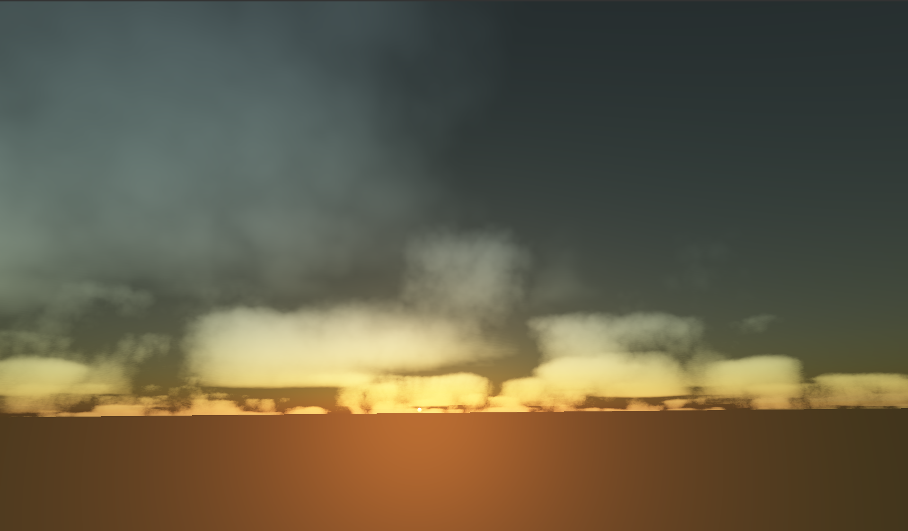
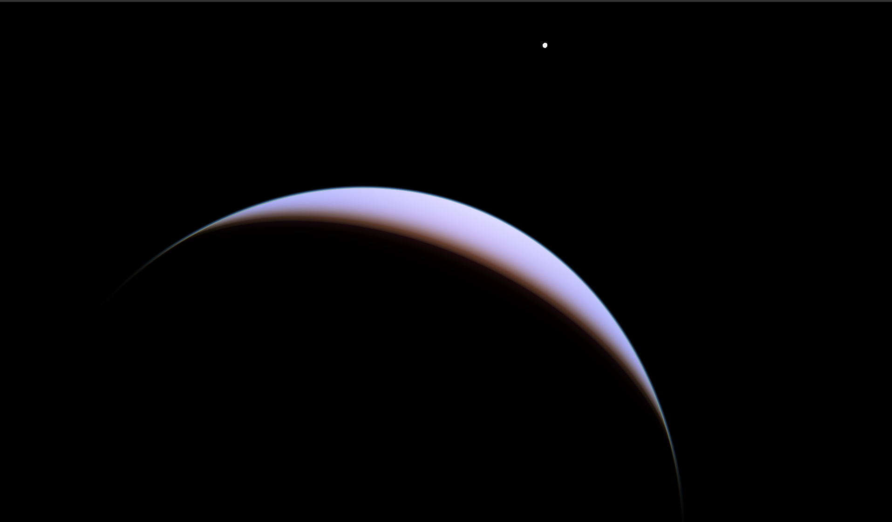
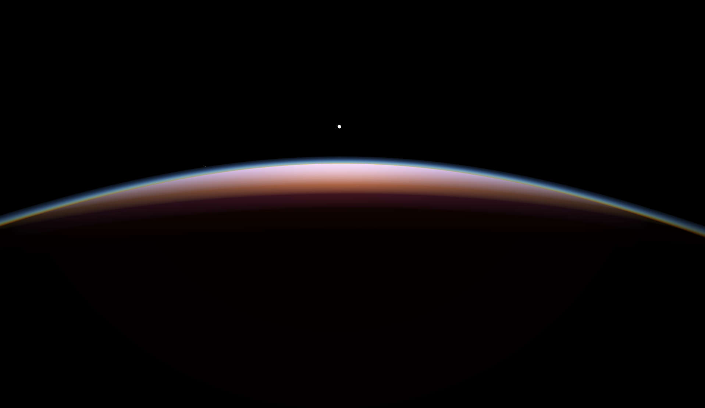
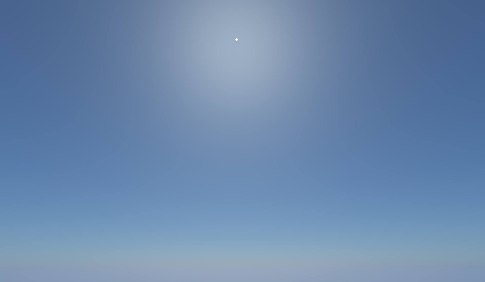
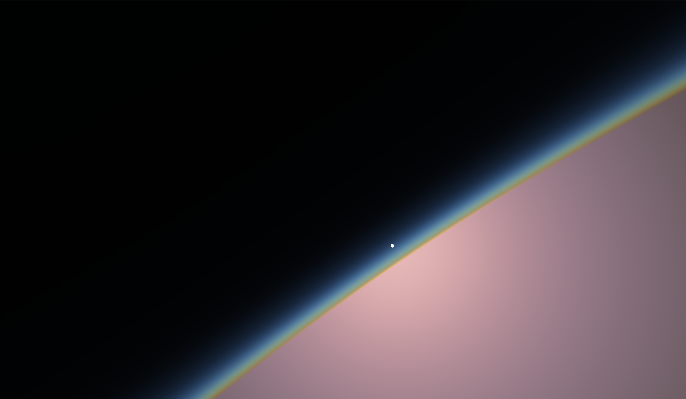
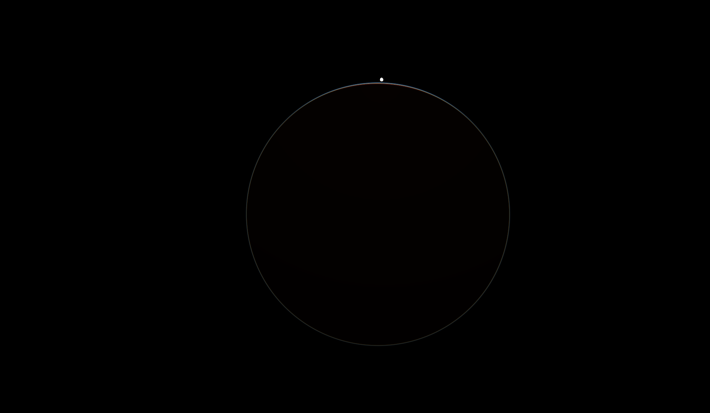
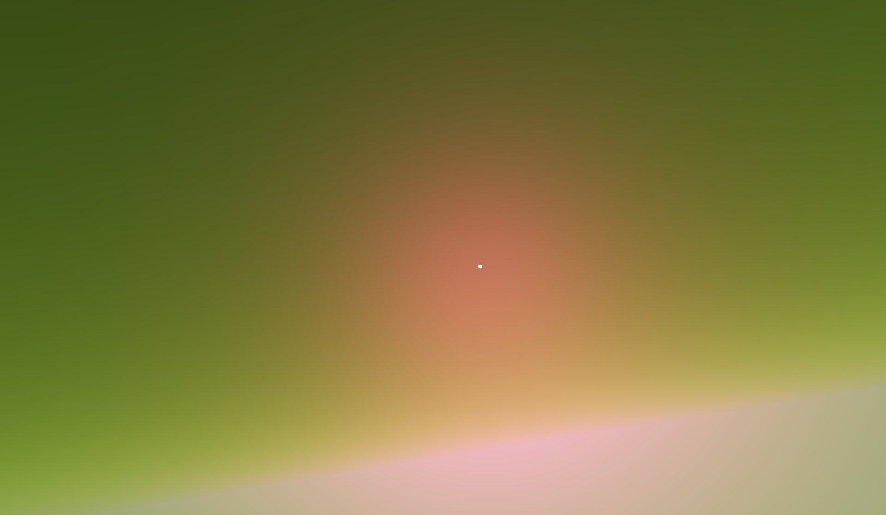

# Natural-Phenomena - University of Leeds 2020 Master's Project
Implementation of natural phenomena rendering techniques:
- Bruneton, E. and Neyret, F. Precomputed atmospheric scattering. In: EGSR ’08: Proceedings of the Nineteenth Eurographics conference on Rendering. Goslar, 2008, pp. 1079 – 1086. 
  http://www-ljk.imag.fr/Publications/Basilic/com.lmc.publi.PUBLI_Article@11e7cdda2f7_f64b69/article.pdf 
- Schneider, A. Real-Time Volumetric Cloudscapes. In: Engel, W. ed. Gpu Pro 7: Advanced Rendering Techniques. Natick: AK Peters, 2016, pp. 97 – 127 

Dependencies:
- Qt 5.13.0 - Core, OpenGL, Widgets, GUI
- GLU
- OpenGL 

In action:

(Volumetric clouds gif is better rendererd in chromium based browsers)

